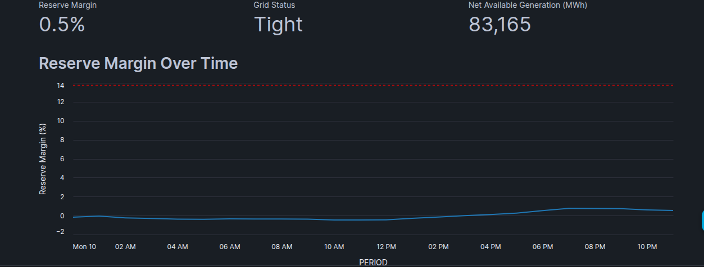
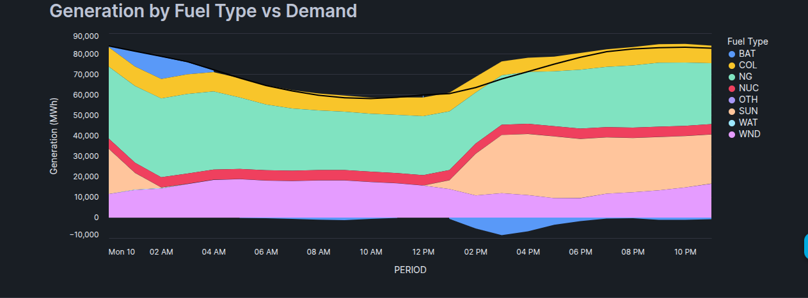
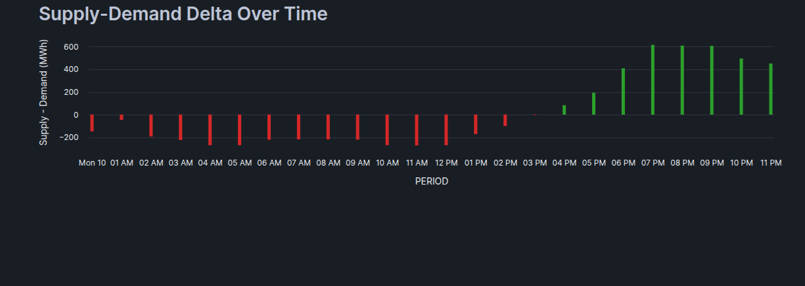
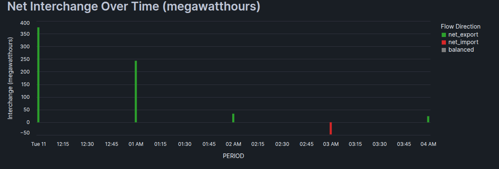
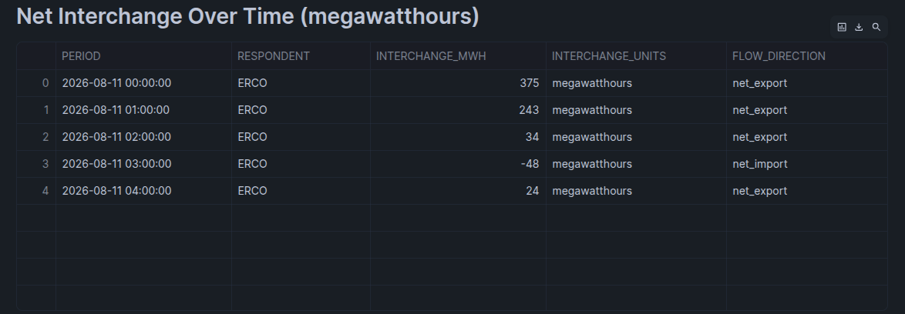

[](LICENSE)

# ERCOT Grid Reliability Pipeline
An end-to-end, production-style data platform that ingests real-time grid data from the U.S. Energy Information Administration (EIA) for ERCOT (the Texas grid operator), transforms it through a cloud-native AWS/Snowflake stack, and surfaces grid reliability metrics—reserve margins, demand vs. generation, and interchange balance—in an interactive dashboard.

Built to demonstrate enterprise-grade cloud data engineering patterns: managed compute (EMR Serverless), Infrastructure as Code (Terraform), governed transformations (dbt + Snowflake), orchestration (Airflow), and gated CI/CD (GitHub Actions with OIDC and manual approval gates).

## Why ERCOT?
Grid reliability is a critical, high-stakes data problem: operators need real-time signal on whether available generation can cover demand—and by what margin.

This pipeline reconstructs that signal from public EIA data, computing a reserve margin percentage and a grid status classification (surplus / adequate / tight / deficit) benchmarked against NERC's ~13.75% reliability target.

## Architecture
Data Flow & Lifecycle
1:Ingestion: Daily pull from the EIA API v2 (demand, interchange, generation-by-fuel for ERCOT) into s3://ercot-grid-pipeline-raw/, partitioned by dataset and date.

2:Transform: PySpark on AWS EMR Serverless reads raw NDJSON, validates schema and casts types, writing curated Parquet to s3://ercot-grid-pipeline-curated/.

3:Load: Snowflake stored procedures COPY curated Parquet into RAW tables via external stages and storage integrations.

4:Model: dbt builds staging views and three reliability marts (mart_grid_reliability, mart_demand_vs_generation, mart_interchange_balance) in the ANALYTICS schema.

5:Orchestrate: Apache Airflow runs the full ingest → transform → load chain daily with automated SMTP failure alerting.

6:Deploy: GitHub Actions CI/CD builds and pushes SHA-tagged Docker images to Amazon ECR, applies Terraform (gated behind manual approval), and syncs dbt models to Snowflake.

7:Visualize: A Streamlit-in-Snowflake dashboard queries directly from the analytical marts under strict RBAC — no data leaves Snowflake.

## Tech Stack

| Layer | Tool |
|---|---|
| Data source | EIA API v2 |
| Object storage | AWS S3 (raw + curated buckets) |
| Compute | AWS EMR Serverless (PySpark) |
| Container registry | AWS ECR |
| Data warehouse | Snowflake |
| Transformation | dbt |
| Orchestration | Apache Airflow 3.3.1 |
| Infrastructure as code | Terraform |
| CI/CD | GitHub Actions (OIDC, no long-lived keys) |
| Dashboard | Streamlit in Snowflake |
| Auth | AWS IAM Identity Center (SSO), Snowflake RSA key-pair (dbt), OIDC (CI/CD) |

---

## Dashboard & Analytics


*Reserve margin, grid status, and generation headroom over time.*


*Generation mix by fuel type against total demand.*


*Flow direction breakdown — net export, import, or balanced.*


*Interchange volume in megawatthours across the reporting window.*


*Underlying interchange records powering the chart above.*


## Key Engineering DecisionsTI-Only Interchange Aggregation:

 The EIA interchange dataset supports both total net interchange (TI) and balancing-authority pairs (fromba/toba). Carried respondent through using TI-only to reduce schema complexity while retaining complete accuracy for ERCOT's single-BA boundary.Per-Dataset Fault Isolation in PySpark: run_transform.py processes demand, interchange, and generation independently. A dataset-level failure won't block healthy datasets from writing curated output, though the job still exits non-zero so Airflow catches and alerts on partial failures.Least-Privilege Role Separation in Snowflake: Segmented Snowflake access control using four strict roles:$$\text{ERCOT\_LOADER} \xrightarrow{\text{Raw Loads}} \text{ERCOT\_TRANSFORMER} \xrightarrow{\text{dbt Transforms}} \text{ERCOT\_ADMIN} \xrightarrow{\text{DDL}} \text{ercot\_app} \xrightarrow{\text{Dashboard Read-Only}}$$OIDC & Keyless CI/CD Authentication: GitHub Actions authenticates to AWS via OIDC federation instead of static IAM access keys, eliminating secret rotation risks. Trust policies are restricted to refs/heads/main and production environment scopes.Immutable Container Images: Docker images are tagged by commit SHA and pushed to an IMMUTABLE ECR repository—preventing tag overwrites and guaranteeing 1:1 traceability between deployed artifacts and Git commits.Gated Deployment Pipeline: Infrastructure changes via Terraform require explicit manual sign-off through GitHub Environment approvals after reviewing generated terraform plan artifacts.

## Repository Structure
```
ercot-grid-pipeline/
├── .github/
│   └── workflows/          # CI (ci.yml) and CD (cd.yml) pipelines
├── airflow/
│   └── dags/               # Airflow orchestration DAGs
├── dbt/
│   └── ercot_dbt/          # dbt project (staging & mart models)
├── ingestion/              # EIA API client wrapper & S3 loader scripts
├── sql/
│   └── snowflake/          # DDL, stored procedures, & RBAC setups
├── src/
│   └── transform/          # PySpark transformation scripts for EMR
├── streamlit_app/          # Streamlit-in-Snowflake dashboard code
├── terraform/              # IaC definitions (S3, IAM, ECR, EMR, OIDC)
└── images/                 # Architecture & dashboard assets
```

## Docker DEBUGING 
ERCOT Airflow DAG — Debug Log

1. Missing Python module — ModuleNotFoundError: No module named 'ingestion'
Cause: PYTHONPATH=/opt/airflow was never set in the Airflow containers, so the mounted ingestion/ package wasn't importable.
Fix: added PYTHONPATH: /opt/airflow under environment: &airflow-common-env in docker-compose.yml.

2. Missing EIA API key — EIA_API_KEY environment variable not set
Cause: the key existed nowhere on the machine (untraceable — checked shell history, dotfiles, git history, AWS Secrets Manager, all clean), and even the root .env wasn't being loaded into the container.
Fix: generated a fresh EIA key, added it to .env, then added env_file: [.env] to docker-compose.yml — Compose doesn't auto-inject root .env into container runtime env, only for compose-file variable substitution (two different mechanisms).

3. AWS SSO auth chain broken — three separate sub-bugs

ProfileNotFound — the AWS mount was at the wrong container path relative to where botocore expects the SSO token cache ($HOME/.aws/sso/cache/, hardcoded, not affected by AWS_CONFIG_FILE/AWS_SHARED_CREDENTIALS_FILE).
PermissionError — host files were 600-permissioned, unreadable by the container's UID 50000 user.
OSError: Read-only file system — the mount was :ro, but botocore needs to write refreshed SSO tokens back to that path.
Fix: mount at /home/airflow/.aws (not a custom path), chmod 644/777 on host files/dirs, and drop :ro from the mount.

4. Fernet key never pinned — root cause of repeated "not found"/decryption errors
Symptom: VARIABLE_NOT_FOUND, Connection not found, and cryptography.fernet.InvalidToken errors kept resurfacing across container recreates.
Cause: AIRFLOW__CORE__FERNET_KEY wasn't set, so each --force-recreate silently generated a new random key, orphaning everything encrypted under the old one.
Fix: generated one fixed key via Fernet.generate_key(), pinned it in .env/docker-compose.yml. Had to delete and recreate all Connections/Variables once, after which it stopped happening.

5. Stale EMR Serverless custom image
Cause: the EMR app's image_configuration was still pinned to an old image tag (v3) that predated the current run_transform.py location.
Fix: rebuild → push new tag → stop-application → update-application --image-configuration → start-application (app must be STOPPED to change image config).

6. Wrong entry point path for the custom EMR image
Cause: DAG's entryPoint pointed at /usr/lib/spark/work-dir/run_transform.py, but the Dockerfile never copied anything there. First attempted fix (/app/src/transform/run_transform.py) verified fine via plain docker run but still failed at actual EMR job runtime — EMR's custom-image environment doesn't treat /app reliably.
Fix: added a dedicated COPY line placing run_transform.py at /usr/lib/spark/work-dir/ — the AWS-documented safe path for EMR Serverless custom images.

7. Snowflake procedure called with wrong arguments/database

CALL load_raw_demand(); — procedures require a run_date DATE param, but the DAG called them with zero arguments.
hook_params had database: "ERCOT" — doesn't exist; real name is AWS_SNOWFLAKE_PIPELINE.
Fix: Jinja-templated the date ('{{ ds }}') into each CALL, corrected the database name.

8. Snowflake "Scoped transaction... incomplete" error
Cause: DELETE + COPY INTO inside EXECUTE IMMEDIATE left an open transaction that never got explicitly committed.
Fix: wrapped the DML in explicit BEGIN TRANSACTION; ... COMMIT; inside all three stored procedures.

9. Invalid auth token / task state mismatch on ingest_eia_to_s3
Symptom: task queued, subprocess dies (SIGKILL), scheduler log shows airflow.sdk.api.client.ServerResponseError: Invalid auth token, task retried then marked failed, DAG fails.
Cause: same root-cause class as #4 — AIRFLOW__API_AUTH__JWT_SECRET (and AIRFLOW__WEBSERVER__SECRET_KEY) was never pinned, so each --force-recreate generated a new random key, causing scheduler/api-server to sign/verify with mismatched keys.
Fix: generated a fixed secret via python3 -c "import secrets; print(secrets.token_hex(32))", stored as AIRFLOW_API_SECRET_KEY in .env, set both AIRFLOW__API_AUTH__JWT_SECRET and AIRFLOW__WEBSERVER__SECRET_KEY to it in docker-compose.yml's x-airflow-common block, then docker compose down && docker compose up -d --force-recreate. Side effect: this recreate also rotates the SimpleAuthManager admin password (separate credential) — read it directly via docker compose exec airflow-api-server cat /opt/airflow/simple_auth_manager_passwords.json.generated if log grep output gets truncated.


## Getting Started
## Prerequisites

- AWS CLI & Terraform >= 1.5
- Snowflake Account with ACCOUNTADMIN access
- Docker & Apache Airflow
- EIA API Key ([Request Here](#))

## Quickstart

### 1. Provision AWS Infrastructure

```bash
cd terraform
terraform init
terraform apply
```

### 2. Configure Snowflake Storage & Roles

Execute the setup scripts in Snowflake **in order**:

1. `sql/snowflake/raw_schema.sql`
2. `sql/snowflake/procedures/load_raw_tables.sql`
3. `sql/snowflake/streamlit/setup_streamlit_app.sql`

### 3. Run dbt Models

```bash
cd dbt/ercot_dbt
dbt deps
dbt build --target prod
```

### 4. Start Airflow Orchestration

```bash
docker compose up -d
```

Access the Airflow UI at [http://localhost:8080](http://localhost:8080) and enable the `ercot_pipeline_dag`.

### 5. Deploy Dashboard

```bash
cd streamlit_app
snow streamlit deploy
```

## Author

**Amon Mugo**
Cloud & Data Engineer
